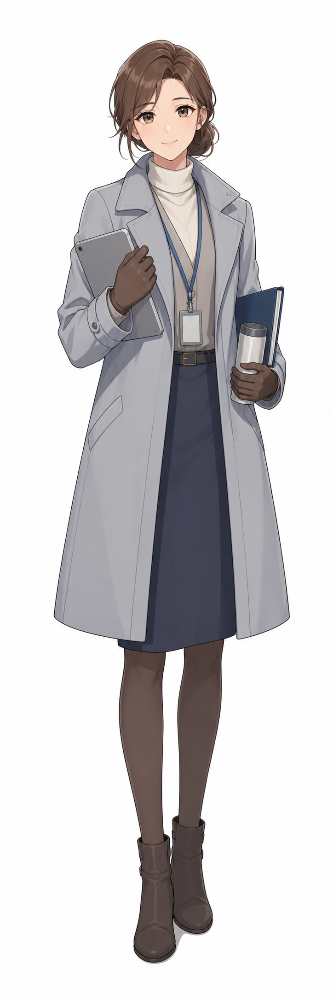
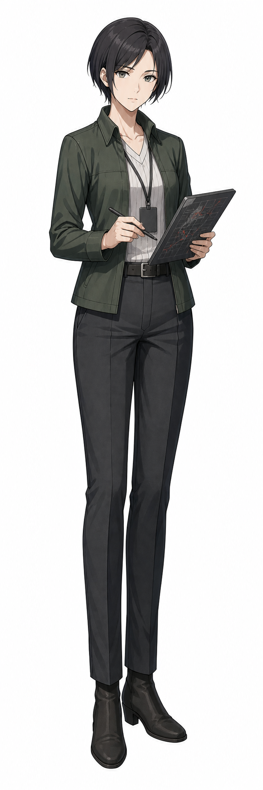
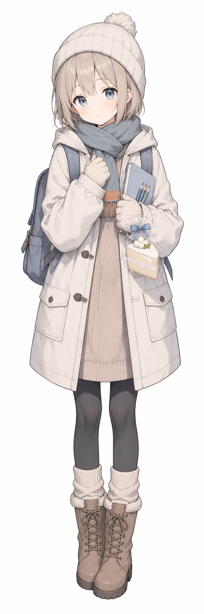
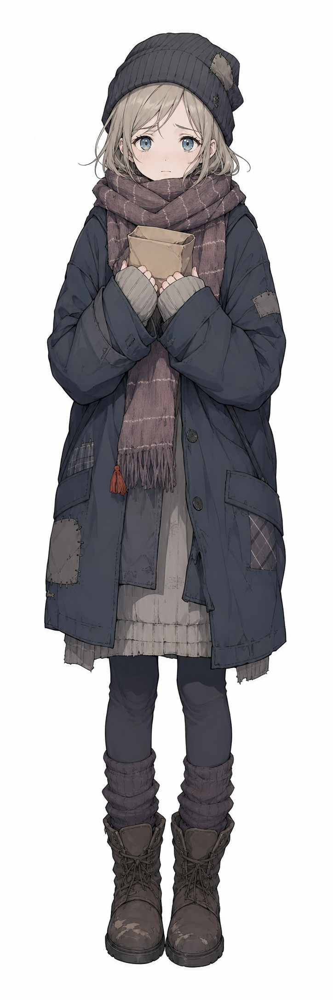
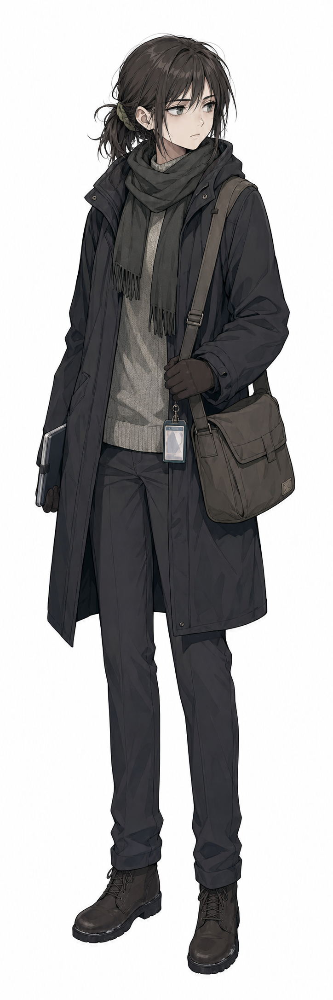
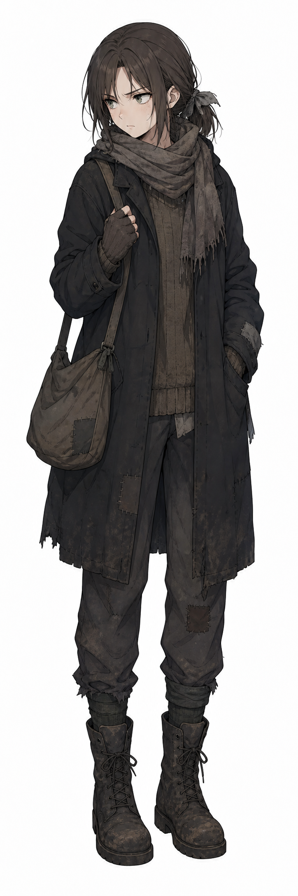

# Character Designs

このディレクトリは、主要キャラクターのキャラクターデザイン画像と、その生成に使用した描画プロンプトを管理する場所です。

## ファイル構成

- `Picture_キャラクター名.png`
  - キャラクターデザイン画像。
- `DrawPrompt_キャラクター名.txt`
  - 対応するキャラクターデザイン画像の描画プロンプト。
- [Gallery.md](./Gallery.md)
  - キャラクターデザイン画像を元サイズで閲覧するためのギャラリー。
- [キャラ描画プロンプト修正ガイド.md](./キャラ描画プロンプト修正ガイド.md)
  - キャラクター設定画として再現性を高めるためのプロンプト修正方針。

## キャラクター別デザイン

| キャラクター | プレビュー | 描画プロンプト |
| --- | --- | --- |
| イリーナ |  | [DrawPrompt_イリーナ.txt](./DrawPrompt_イリーナ.txt) |
| サーヤ |  | [DrawPrompt_サーヤ.txt](./DrawPrompt_サーヤ.txt) |
| スネジャーナ（アヴローラ移住後） |  | [DrawPrompt_スネジャーナ(アヴローラ移住後).txt](./DrawPrompt_スネジャーナ(アヴローラ移住後).txt) |
| スネジャーナ（ベルザニア時代） |  | [DrawPrompt_スネジャーナ(ベルザニア時代).txt](./DrawPrompt_スネジャーナ(ベルザニア時代).txt) |
| マリューシャ（アヴローラ移住後） |  | [DrawPrompt_マリューシャ(アヴローラ移住後).txt](./DrawPrompt_マリューシャ(アヴローラ移住後).txt) |
| マリューシャ（ベルザニア時代） |  | [DrawPrompt_マリューシャ(ベルザニア時代).txt](./DrawPrompt_マリューシャ(ベルザニア時代).txt) |

## 更新方針

- 新しいキャラクターを追加する場合は、画像を `Picture_キャラクター名.png`、描画プロンプトを `DrawPrompt_キャラクター名.txt` の形式で追加する。
- 同一キャラクターに時代差分や衣装差分がある場合は、ファイル名に差分名を含める。
- プロンプトを修正する場合は、[キャラ描画プロンプト修正ガイド.md](./キャラ描画プロンプト修正ガイド.md) の方針に沿って、設定画としての再現性を優先する。
